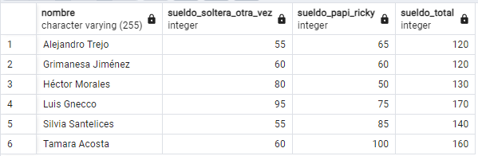
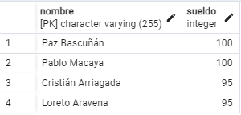
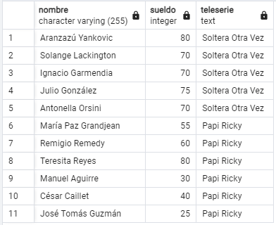
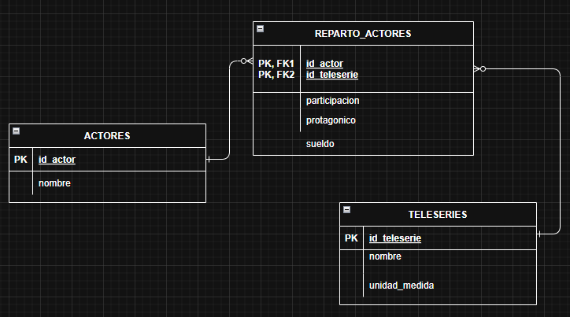
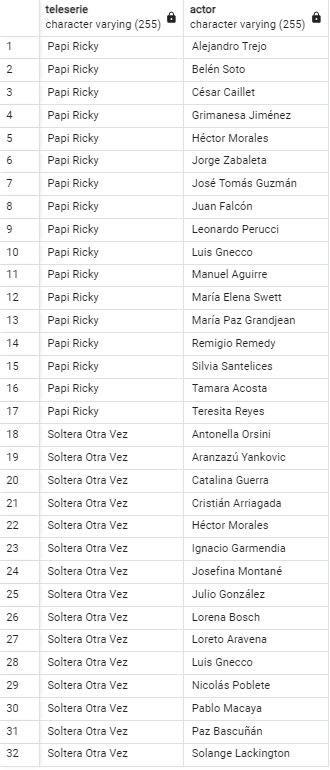

# Evaluación Módulo 5

Respuestas en [respuestas_evaluacion_modulo_5.sql](respuestas_evaluacion_modulo_5.sql).

## Parte 1: JOIN

**Act 1.** Actores que participaron en ambas teleseries, sueldo en cada una y suma total, ordenado por nombre.

**Act 2.** Actores exclusivos de Soltera Otra Vez con sueldo mayor a 90.

**Act 3.** Actores con sueldo inferior a 85 que actuaron en una sola de las dos teleseries.

## Parte 2: Modelo Entidad Relación

**Act 1.** Diagrama entidad-relación terminado (`actores`, `teleseries`, `reparto_actores`).

**Act 2.** Scripts de creación de tablas, llaves y datos migrados desde el modelo original, pueden verse en el archivo respuestas_evaluacion_modulo_5.sql

**Act 3.** Consulta con todas las teleseries y sus actores protagónicos asociados.

